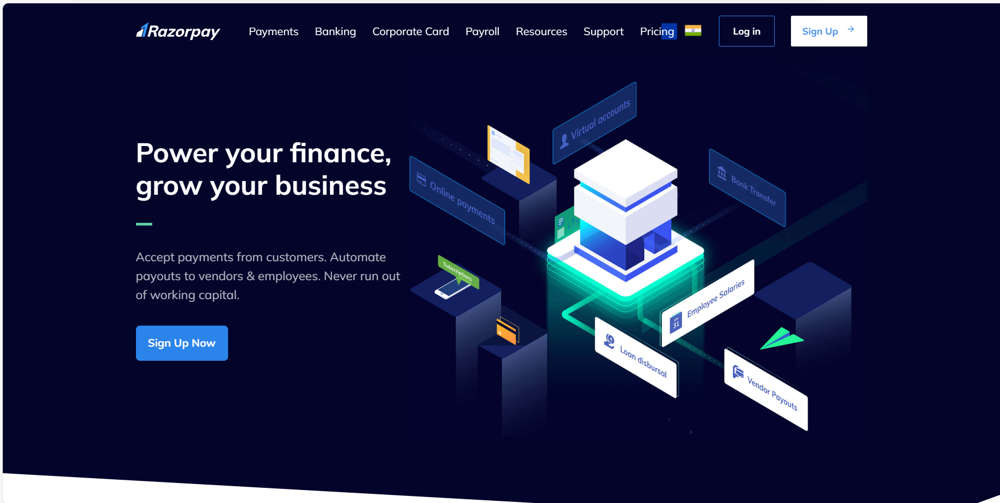

# Razorpay-clone - Online Payment Platform
:rocket: [Link to website][https://studynotion-frontend.vercel.app/]

Introducing PaySwift, a cutting-edge payment gateway solution that mirrors the seamless experience of Razorpay
. PaySwift allows businesses to effortlessly manage online transactions, providing a secure and user-friendly platform for payments. With a robust infrastructure, 
real-time payment processing, and an intuitive dashboard, PaySwift empowers merchants to enhance their customers' payment experience. From swift checkouts to comprehensive
transaction analytics, PaySwift is your go-to solution for reliable and efficient online payments. Experience the future of online transactions with PaySwift – where simplicity meets security.

The back-end of the platform is built using NodeJS and ExpressJS, providing APIs for the front-end to consume. These APIs include functionalities such as user authentication, course creation, and course consumption. The back-end also handles the logic for processing and storing the course content and user data.

